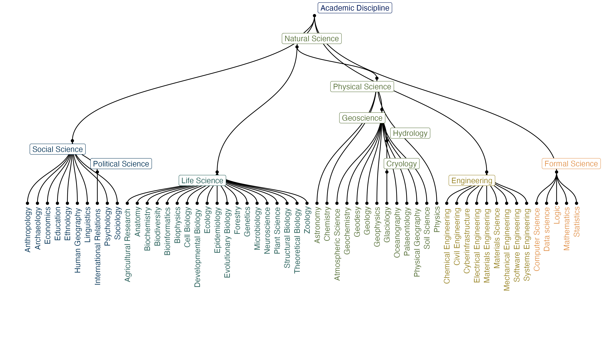

# ADC Disciplines

A simplified disciplinary taxonomy for classification at the Arctic Data Center.

This taxonomy contains data from the https://re3data.org subject classification, which in turn
was from data in the academic subject vocabulary created by DFG.

